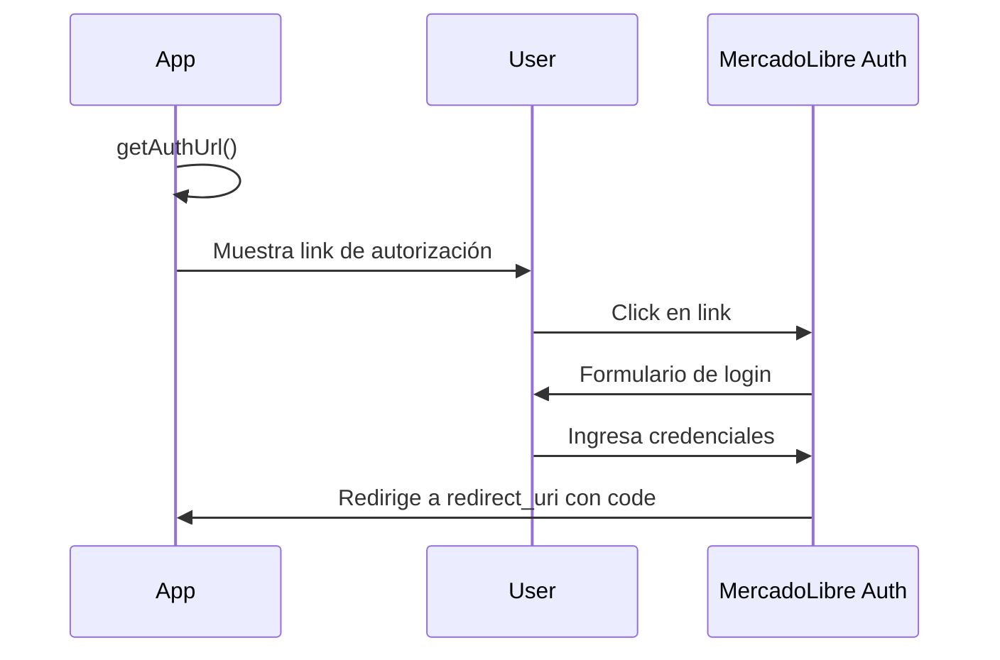

# 📖 Referencia de la API

## Índice

1. [Constructor](#constructor)
2. [Métodos de Autenticación OAuth](#métodos-de-autenticación-oauth)
3. [Métodos HTTP](#métodos-http)
4. [Métodos Auxiliares](#métodos-auxiliares)
5. [Propiedades Estáticas](#propiedades-estáticas)
6. [Códigos de Respuesta](#códigos-de-respuesta)
7. [Manejo de Errores](#manejo-de-errores)

---

## Constructor

### `__construct()`

Crea una nueva instancia del cliente MercadoLibre.

```php
public function __construct(
    string $client_id,
    string $client_secret,
    ?string $access_token = null,
    ?string $refresh_token = null
): Meli
```

#### Parámetros

| Parámetro | Tipo | Requerido | Descripción |
|-----------|------|-----------|-------------|
| `$client_id` | `string` | ✅ Sí | Tu Application ID de MercadoLibre |
| `$client_secret` | `string` | ✅ Sí | Tu Secret Key |
| `$access_token` | `string` | ❌ No | Token de acceso si ya lo tienes almacenado |
| `$refresh_token` | `string` | ❌ No | Token de renovación para offline access |

#### Retorno
- **Tipo**: `Meli`
- **Descripción**: Instancia del cliente configurado

#### Ejemplos

**Uso básico (sin tokens previos)**:
```php
$meli = new Meli('1234567890', 'tu_secret_key');
```

**Con tokens existentes**:
```php
$meli = new Meli(
    '1234567890',
    'tu_secret_key',
    $_SESSION['access_token'],
    $_SESSION['refresh_token']
);
```

---

## Métodos de Autenticación OAuth

### `getAuthUrl()`

Genera la URL de autorización para redirigir al usuario a la página de login de MercadoLibre.

```php
public function getAuthUrl(
    string $redirect_uri,
    string $auth_url
): string
```

#### Parámetros

| Parámetro | Tipo | Requerido | Descripción |
|-----------|------|-----------|-------------|
| `$redirect_uri` | `string` | ✅ Sí | URL donde MercadoLibre redirigirá después de la autorización |
| `$auth_url` | `string` | ✅ Sí | URL del servidor de autenticación según el país (usar `Meli::$AUTH_URL['SITE_ID']`) |

#### Retorno
- **Tipo**: `string`
- **Descripción**: URL completa de autorización OAuth

#### Ejemplo

```php
$meli = new Meli('1234567890', 'secret_key');

// Para Argentina
$authUrl = $meli->getAuthUrl(
    'http://localhost:8000/callback.php',
    Meli::$AUTH_URL['MLA']
);

echo '<a href="' . $authUrl . '">Iniciar sesión con MercadoLibre</a>';
// Output: https://auth.mercadolibre.com.ar/authorization?client_id=1234567890&response_type=code&redirect_uri=...
```

#### Flujo típico


---

### `authorize()`

Intercambia el código de autorización por un access_token y refresh_token.

```php
public function authorize(
    string $code,
    string $redirect_uri
): array
```

#### Parámetros

| Parámetro | Tipo | Requerido | Descripción |
|-----------|------|-----------|-------------|
| `$code` | `string` | ✅ Sí | Código de autorización recibido en el callback (parámetro `code` en la URL) |
| `$redirect_uri` | `string` | ✅ Sí | Mismo redirect_uri usado en `getAuthUrl()` |

#### Retorno
- **Tipo**: `array`
- **Estructura**:
```php
[
    'body' => stdClass {
        'access_token' => 'APP_USR-1234...',
        'token_type' => 'Bearer',
        'expires_in' => 21600,  // 6 horas en segundos
        'scope' => 'offline_access read write',
        'user_id' => 123456789,
        'refresh_token' => 'TG-5678...'  // Solo si tienes offline_access
    },
    'httpCode' => 200
]
```

#### Ejemplo

```php
$meli = new Meli('1234567890', 'secret_key');

// En tu callback.php
if (isset($_GET['code'])) {
    $result = $meli->authorize($_GET['code'], 'http://localhost:8000/callback.php');
    
    if ($result['httpCode'] == 200) {
        $_SESSION['access_token'] = $result['body']->access_token;
        $_SESSION['refresh_token'] = $result['body']->refresh_token;
        $_SESSION['expires_in'] = time() + $result['body']->expires_in;
        
        echo "¡Autenticación exitosa!";
    } else {
        echo "Error: " . $result['body']->message;
    }
}
```

#### Notas importantes
- El código de autorización es de **un solo uso**
- El access_token expira en **6 horas** por defecto
- Guarda el refresh_token para renovar el access_token sin pedir login nuevamente

---

### `refreshAccessToken()`

Renueva un access_token expirado usando el refresh_token.

```php
public function refreshAccessToken(): array
```

#### Parámetros
Ninguno. Usa el `refresh_token` almacenado en la instancia.

#### Retorno
- **Tipo**: `array`
- **Estructura**:
```php
[
    'body' => stdClass {
        'access_token' => 'APP_USR-new-token...',
        'token_type' => 'Bearer',
        'expires_in' => 21600,
        'scope' => 'offline_access read write',
        'user_id' => 123456789,
        'refresh_token' => 'TG-new-refresh...'  // Puede cambiar
    },
    'httpCode' => 200
]
```

#### Ejemplo

```php
$meli = new Meli(
    '1234567890',
    'secret_key',
    $_SESSION['access_token'],
    $_SESSION['refresh_token']
);

// Verificar si el token expiró
if (time() > $_SESSION['expires_in']) {
    $refresh = $meli->refreshAccessToken();
    
    if ($refresh['httpCode'] == 200) {
        $_SESSION['access_token'] = $refresh['body']->access_token;
        $_SESSION['refresh_token'] = $refresh['body']->refresh_token;
        $_SESSION['expires_in'] = time() + $refresh['body']->expires_in;
    }
}
```

#### Manejo de errores

```php
$refresh = $meli->refreshAccessToken();

if (isset($refresh['error'])) {
    // No hay refresh_token disponible
    echo "Error: " . $refresh['error'];
    // Solución: Pedir al usuario que se autentique nuevamente
}
```

---

## Métodos HTTP

### `get()`

Ejecuta una petición GET a la API de MercadoLibre.

```php
public function get(
    string $path,
    ?array $params = null,
    bool $assoc = false
): array
```

#### Parámetros

| Parámetro | Tipo | Requerido | Descripción |
|-----------|------|-----------|-------------|
| `$path` | `string` | ✅ Sí | Ruta del endpoint (ej: `/users/me`, `/items/MLB123`) |
| `$params` | `array` | ❌ No | Parámetros de query string (ej: `['access_token' => '...', 'limit' => 50]`) |
| `$assoc` | `bool` | ❌ No | Si es `true`, retorna arrays asociativos en lugar de objetos |

#### Retorno
```php
[
    'body' => mixed,      // stdClass o array según $assoc
    'httpCode' => int     // Código HTTP (200, 404, 401, etc.)
]
```

#### Ejemplos

**Obtener información pública (sin autenticación)**:
```php
$meli = new Meli('app_id', 'secret');
$result = $meli->get('/sites/MLB');

echo $result['body']->name;  // "Brasil"
echo $result['body']->default_currency_id;  // "BRL"
```

**Obtener información del usuario autenticado**:
```php
$params = ['access_token' => $_SESSION['access_token']];
$result = $meli->get('/users/me', $params);

if ($result['httpCode'] == 200) {
    echo "Hola, " . $result['body']->nickname;
}
```

**Con resultado como array asociativo**:
```php
$result = $meli->get('/users/me', $params, true);
echo $result['body']['nickname'];  // Acceso con array en lugar de objeto
```

**Búsqueda de productos**:
```php
$params = [
    'q' => 'iphone',
    'limit' => 10
];
$result = $meli->get('/sites/MLB/search', $params);

foreach ($result['body']->results as $item) {
    echo $item->title . " - $" . $item->price . "\n";
}
```

---

### `post()`

Ejecuta una petición POST a la API (crear recursos).

```php
public function post(
    string $path,
    ?array $body = null,
    array $params = []
): array
```

#### Parámetros

| Parámetro | Tipo | Requerido | Descripción |
|-----------|------|-----------|-------------|
| `$path` | `string` | ✅ Sí | Ruta del endpoint |
| `$body` | `array` | ❌ No | Cuerpo de la petición (será convertido a JSON automáticamente) |
| `$params` | `array` | ❌ No | Parámetros de query string (típicamente `access_token`) |

#### Retorno
```php
[
    'body' => stdClass,
    'httpCode' => int
]
```

#### Ejemplos

**Publicar un producto**:
```php
$item = [
    'title' => 'iPhone 14 Pro',
    'category_id' => 'MLB1051',
    'price' => 5999.99,
    'currency_id' => 'BRL',
    'available_quantity' => 10,
    'buying_mode' => 'buy_it_now',
    'listing_type_id' => 'gold_special',
    'condition' => 'new',
    'description' => [
        'plain_text' => 'iPhone 14 Pro nuevo en caja sellada'
    ],
    'pictures' => [
        ['source' => 'https://example.com/iphone.jpg']
    ]
];

$response = $meli->post('/items', $item, [
    'access_token' => $_SESSION['access_token']
]);

if ($response['httpCode'] == 201) {
    echo "Item creado con ID: " . $response['body']->id;
    echo "Ver en: " . $response['body']->permalink;
} else {
    echo "Error: " . $response['body']->message;
}
```

**Responder una pregunta**:
```php
$answer = [
    'question_id' => 123456789,
    'text' => 'Sí, tenemos stock disponible'
];

$response = $meli->post('/answers', $answer, [
    'access_token' => $_SESSION['access_token']
]);
```

---

### `put()`

Ejecuta una petición PUT a la API (actualizar recursos).

```php
public function put(
    string $path,
    ?array $body = null,
    array $params = []
): array
```

#### Parámetros
Idénticos a `post()`.

#### Ejemplos

**Actualizar precio de un producto**:
```php
$updates = [
    'price' => 4999.99,
    'available_quantity' => 5
];

$response = $meli->put('/items/MLB123456', $updates, [
    'access_token' => $_SESSION['access_token']
]);

if ($response['httpCode'] == 200) {
    echo "Precio actualizado correctamente";
}
```

**Pausar un producto**:
```php
$response = $meli->put('/items/MLB123456', ['status' => 'paused'], [
    'access_token' => $_SESSION['access_token']
]);
```

**Actualizar descripción**:
```php
$description = [
    'plain_text' => 'Nueva descripción detallada del producto'
];

$response = $meli->put('/items/MLB123456/description', $description, [
    'access_token' => $_SESSION['access_token']
]);
```

---

### `delete()`

Ejecuta una petición DELETE a la API (eliminar recursos).

```php
public function delete(
    string $path,
    array $params
): array
```

#### Parámetros

| Parámetro | Tipo | Requerido | Descripción |
|-----------|------|-----------|-------------|
| `$path` | `string` | ✅ Sí | Ruta del endpoint |
| `$params` | `array` | ✅ Sí | Parámetros (obligatorio incluir `access_token`) |

#### Ejemplos

**Eliminar una pregunta**:
```php
$response = $meli->delete('/questions/123456789', [
    'access_token' => $_SESSION['access_token']
]);

if ($response['httpCode'] == 200) {
    echo "Pregunta eliminada";
}
```

**Nota**: En MercadoLibre, no se pueden eliminar items directamente. Debes cambiar su estado a "closed":
```php
// Cerrar un item (equivalente a eliminar)
$response = $meli->put('/items/MLB123456', ['status' => 'closed'], [
    'access_token' => $_SESSION['access_token']
]);
```

---

### `options()`

Ejecuta una petición OPTIONS a la API (obtener metadatos del endpoint).

```php
public function options(
    string $path,
    ?array $params = null
): array
```

#### Ejemplo

```php
$result = $meli->options('/items');
// Retorna información sobre qué métodos HTTP están permitidos, qué campos son requeridos, etc.
```

---

## Métodos Auxiliares

### `execute()`

**Uso interno**. Método base que ejecuta todas las peticiones HTTP.

```php
public function execute(
    string $path,
    array $opts = [],
    array $params = [],
    bool $assoc = false
): array
```

**No deberías llamar este método directamente**. Usa `get()`, `post()`, `put()`, `delete()` en su lugar.

---

### `make_path()`

**Uso interno**. Construye la URL completa del endpoint.

```php
public function make_path(
    string $path,
    array $params = []
): string
```

#### Ejemplo interno
```php
$url = $this->make_path('/users/me', ['access_token' => 'ABC123']);
// Resultado: https://api.mercadolibre.com/users/me?access_token=ABC123
```

---

## Propiedades Estáticas

### `Meli::$API_ROOT_URL`

```php
protected static $API_ROOT_URL = "https://api.mercadolibre.com";
```

**Descripción**: URL base de la API de MercadoLibre.

---

### `Meli::$OAUTH_URL`

```php
protected static $OAUTH_URL = "/oauth/token";
```

**Descripción**: Endpoint para operaciones de OAuth (autorización y refresh).

---

### `Meli::$AUTH_URL`

```php
public static $AUTH_URL = [
    "MLA" => "https://auth.mercadolibre.com.ar",  // Argentina
    "MLB" => "https://auth.mercadolivre.com.br",  // Brasil
    "MLM" => "https://auth.mercadolibre.com.mx",  // México
    // ... otros países
];
```

**Descripción**: Mapa de URLs de autenticación por país.

**Uso**:
```php
$authUrl = $meli->getAuthUrl($redirectUri, Meli::$AUTH_URL['MLB']);
```

---

### `Meli::$CURL_OPTS`

```php
public static $CURL_OPTS = [
    CURLOPT_USERAGENT => "MELI-PHP-SDK-2.0.0",
    CURLOPT_SSL_VERIFYPEER => true,
    CURLOPT_CONNECTTIMEOUT => 10,
    CURLOPT_RETURNTRANSFER => 1,
    CURLOPT_TIMEOUT => 60
];
```

**Descripción**: Configuración por defecto de cURL.

**Personalizar timeout**:
```php
Meli::$CURL_OPTS[CURLOPT_TIMEOUT] = 120;  // 2 minutos
$meli = new Meli($appId, $secretKey);
```

---

## Códigos de Respuesta

### Códigos HTTP Comunes

| Código | Significado | Descripción |
|--------|-------------|-------------|
| 200 | OK | Petición exitosa (GET, PUT, DELETE) |
| 201 | Created | Recurso creado exitosamente (POST) |
| 204 | No Content | Petición exitosa sin contenido |
| 400 | Bad Request | Parámetros inválidos o faltantes |
| 401 | Unauthorized | Access token inválido o expirado |
| 403 | Forbidden | No tienes permisos para este recurso |
| 404 | Not Found | Recurso no encontrado |
| 429 | Too Many Requests | Límite de rate excedido |
| 500 | Internal Server Error | Error en el servidor de MercadoLibre |
| 503 | Service Unavailable | Servicio temporalmente no disponible |

### Verificar Códigos

```php
$result = $meli->get('/users/me', $params);

switch ($result['httpCode']) {
    case 200:
        echo "Éxito: " . $result['body']->nickname;
        break;
    case 401:
        echo "Token expirado, renovando...";
        $meli->refreshAccessToken();
        break;
    case 404:
        echo "Usuario no encontrado";
        break;
    default:
        echo "Error: " . $result['httpCode'];
}
```

---

## Manejo de Errores

### Estructura de Errores

Cuando ocurre un error, la API retorna:

```php
[
    'body' => stdClass {
        'message' => 'Error description',
        'error' => 'error_code',
        'status' => 400,
        'cause' => []  // Array con detalles del error
    },
    'httpCode' => 400
]
```

### Ejemplo de Manejo Robusto

```php
function createItem($meli, $item, $accessToken) {
    $response = $meli->post('/items', $item, ['access_token' => $accessToken]);
    
    if ($response['httpCode'] >= 200 && $response['httpCode'] < 300) {
        return [
            'success' => true,
            'item_id' => $response['body']->id,
            'permalink' => $response['body']->permalink
        ];
    }
    
    // Manejo de errores específicos
    $error = $response['body'];
    $message = $error->message ?? 'Error desconocido';
    
    if ($response['httpCode'] == 401) {
        // Token expirado
        return ['success' => false, 'error' => 'Token expirado, por favor reautentique'];
    }
    
    if ($response['httpCode'] == 400 && isset($error->cause)) {
        // Errores de validación
        $causes = array_map(function($cause) {
            return $cause->message ?? $cause->code;
        }, $error->cause);
        
        return ['success' => false, 'errors' => $causes];
    }
    
    return ['success' => false, 'error' => $message];
}
```

### Errores OAuth Comunes

| Error | Causa | Solución |
|-------|-------|----------|
| `invalid_grant` | Código de autorización inválido o expirado | Obtener nuevo código iniciando flujo OAuth nuevamente |
| `invalid_client` | client_id o client_secret incorrectos | Verificar credenciales en configApp.php |
| `redirect_uri_mismatch` | redirect_uri no coincide con la registrada | Actualizar en tu app de MercadoLibre |

---

## Ejemplos Avanzados

### Paginación

```php
function getAllUserItems($meli, $accessToken) {
    $offset = 0;
    $limit = 50;
    $allItems = [];
    
    do {
        $result = $meli->get('/users/me/items/search', [
            'access_token' => $accessToken,
            'offset' => $offset,
            'limit' => $limit
        ]);
        
        if ($result['httpCode'] != 200) break;
        
        $items = $result['body']->results;
        $allItems = array_merge($allItems, $items);
        
        $offset += $limit;
        $totalItems = $result['body']->paging->total;
        
    } while ($offset < $totalItems);
    
    return $allItems;
}
```

### Rate Limiting

```php
class MeliWithRateLimit {
    private $meli;
    private $requestCount = 0;
    private $maxRequests = 100;  // Por minuto
    
    public function get($path, $params = null) {
        if ($this->requestCount >= $this->maxRequests) {
            sleep(60);  // Esperar 1 minuto
            $this->requestCount = 0;
        }
        
        $this->requestCount++;
        return $this->meli->get($path, $params);
    }
}
```

---

## Recursos Adicionales

- **API Docs oficial**: https://developers.mercadolibre.com/api-docs
- **Explorador de API**: https://developers.mercadolibre.com/api-docs/resources/
- **Postman Collection**: Disponible en el portal de desarrolladores

---

**Siguiente**: [EXAMPLES.md](./EXAMPLES.md) - Casos de uso completos

