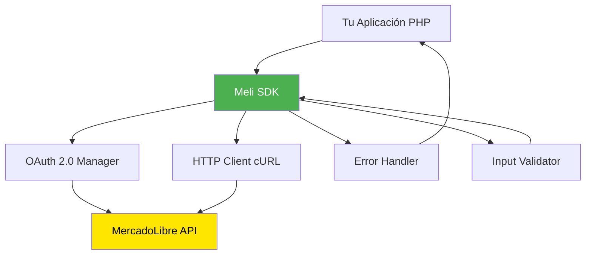
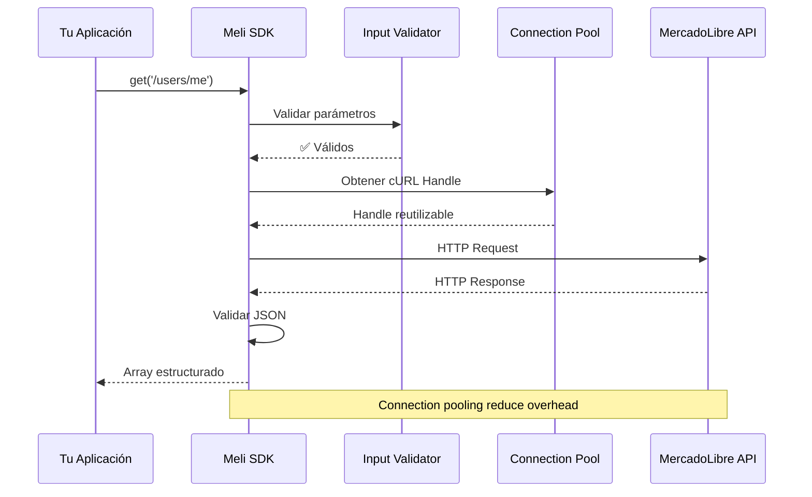
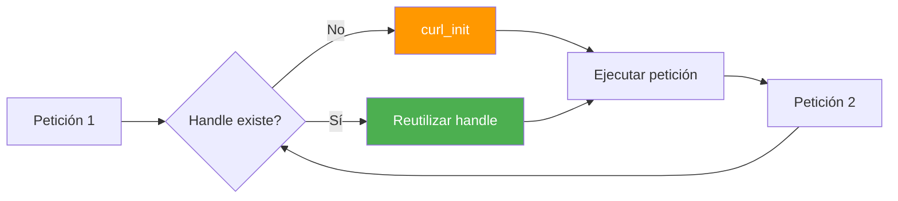
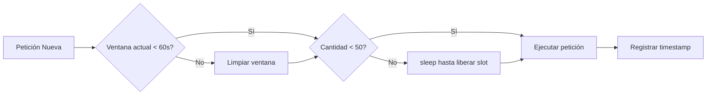
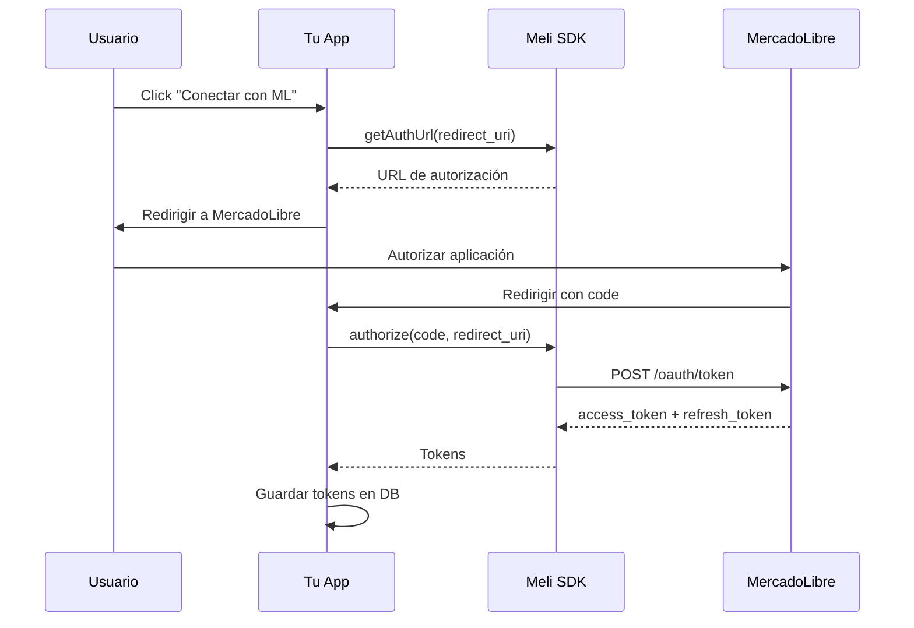
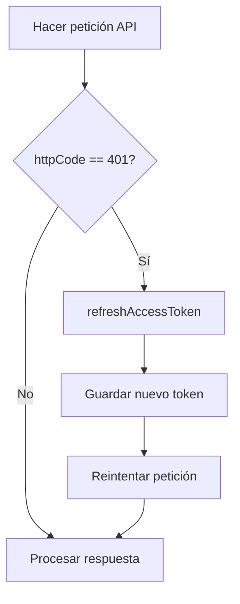
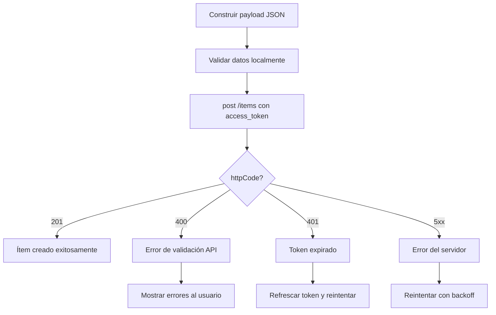

# 🧠 Conceptos Fundamentales - MercadoLibre PHP SDK

Este documento explica los conceptos técnicos clave del SDK, su arquitectura interna y los principios de diseño implementados.

---

## 📋 Tabla de Contenidos

1. [Arquitectura General](#arquitectura-general)
2. [Ciclo de Vida de una Petición](#ciclo-de-vida-de-una-petición)
3. [Manejo de Errores Robusto](#manejo-de-errores-robusto)
4. [Validación de Inputs](#validación-de-inputs)
5. [Connection Pooling](#connection-pooling)
6. [Rate Limiting](#rate-limiting)
7. [Flujos de Negocio](#flujos-de-negocio)

---

## 🏗️ Arquitectura General

El SDK implementa un **patrón Facade/Wrapper** sobre la API de MercadoLibre, simplificando la interacción con el ecosistema de servicios.



### Componentes Principales

| Componente | Responsabilidad | Archivo |
|------------|-----------------|---------|
| **Meli** | Cliente principal del SDK | `Meli/meli.php` |
| **RateLimitedMeli** | Cliente con limitación de tasa | `Meli/RateLimitedMeli.php` |
| **OAuth Manager** | Gestión de tokens y autorización | Integrado en `Meli` |
| **HTTP Executor** | Ejecución de peticiones cURL | Método `execute()` |
| **Validator** | Validación de inputs | Integrado en constructores |

---

## 🔄 Ciclo de Vida de una Petición



### Fases de Ejecución

1. **Inicialización**: Validación de credenciales en `__construct()`
2. **Validación**: Comprobación de parámetros de entrada
3. **Construcción**: Formación de URL y headers
4. **Ejecución**: Petición HTTP con cURL
5. **Validación de Respuesta**: Parsing y validación de JSON
6. **Retorno Estructurado**: Estructura consistente `['body' => ..., 'httpCode' => ...]`

---

## ⚠️ Manejo de Errores Robusto

### Filosofía de Diseño

**Principio**: El SDK **NUNCA** retorna `null` silenciosamente. Todas las fallas se comunican mediante:
1. **Excepciones** para errores de entrada (validación)
2. **Estructuras de error** para fallas de red/API

### Estructura de Respuesta Consistente

```php
// ✅ Respuesta exitosa
array(
    'body' => [...],           // Datos parseados de la API
    'httpCode' => 200          // Código HTTP
)

// ⚠️ Respuesta con error de red
array(
    'error' => 'cURL Error (6): Could not resolve host',
    'httpCode' => 0,
    'body' => null
)

// ⚠️ Respuesta con error de JSON
array(
    'body' => '{"invalid json',  // Response cruda
    'httpCode' => 200,
    'error' => 'JSON decode error: Syntax error'
)
```

### Tipos de Errores Manejados

#### 1. Errores de cURL (Errores de Red)

```php
public function execute($path, $opts = array(), $params = array(), $assoc = false) {
    // ...
    $response = curl_exec($ch);
    $curlError = curl_error($ch);
    $curlErrno = curl_errno($ch);
    
    if ($curlErrno !== 0) {
        $httpCode = curl_getinfo($ch, CURLINFO_HTTP_CODE);
        curl_close($ch);
        return array(
            'error' => "cURL Error ($curlErrno): $curlError",
            'httpCode' => $httpCode ? $httpCode : 0,
            'body' => null
        );
    }
    // ...
}
```

**Errores comunes capturados:**
- `CURLE_COULDNT_RESOLVE_HOST (6)`: DNS no resuelve
- `CURLE_OPERATION_TIMEDOUT (28)`: Timeout de conexión
- `CURLE_SSL_CONNECT_ERROR (35)`: Error SSL/TLS
- `CURLE_GOT_NOTHING (52)`: Servidor no respondió

#### 2. Errores de Parsing JSON

```php
$decodedBody = json_decode($response, $assoc);
$jsonError = json_last_error();

if ($jsonError !== JSON_ERROR_NONE && !empty($response)) {
    $jsonErrorMsg = function_exists('json_last_error_msg') 
        ? json_last_error_msg() 
        : "JSON Error code: $jsonError";
    
    error_log("Meli SDK - JSON decode error: $jsonErrorMsg. Response preview: " . substr($response, 0, 200));
    
    return array(
        'body' => $response,        // Response cruda para debugging
        'httpCode' => $httpCode,
        'error' => "JSON decode error: $jsonErrorMsg"
    );
}
```

**Errores JSON capturados:**
- `JSON_ERROR_SYNTAX`: Sintaxis JSON inválida
- `JSON_ERROR_UTF8`: Codificación UTF-8 incorrecta
- `JSON_ERROR_DEPTH`: Profundidad máxima excedida

#### 3. Inicialización de cURL Fallida

```php
$ch = curl_init($uri);

if ($ch === false) {
    return array(
        'error' => 'Failed to initialize cURL session',
        'httpCode' => 0,
        'body' => null
    );
}
```

### Ejemplo de Uso con Manejo de Errores

```php
$meli = new Meli($client_id, $client_secret);

$response = $meli->get('/users/me', ['access_token' => $token]);

// ✅ Verificar errores
if (isset($response['error'])) {
    // Error de red o parsing
    error_log("SDK Error: " . $response['error']);
    echo "Error comunicándose con MercadoLibre: {$response['error']}";
    exit;
}

// ✅ Verificar códigos HTTP
if ($response['httpCode'] >= 400) {
    // Error de la API (400, 401, 500, etc.)
    $errorMsg = $response['body']['message'] ?? 'Error desconocido';
    echo "API Error ({$response['httpCode']}): {$errorMsg}";
    exit;
}

// ✅ Respuesta exitosa
$user = $response['body'];
echo "Hola, {$user['nickname']}!";
```

---

## 🛡️ Validación de Inputs

### Filosofía de Diseño

**Principio**: Validar inputs temprano y lanzar excepciones descriptivas para prevenir estados inconsistentes.

### Validaciones Implementadas

#### 1. Constructor: Validación de Credenciales

```php
public function __construct($client_id, $client_secret, $access_token = null, $refresh_token = null) {
    if (empty($client_id) || !is_string($client_id)) {
        throw new InvalidArgumentException('client_id is required and must be a non-empty string');
    }
    
    if (empty($client_secret) || !is_string($client_secret)) {
        throw new InvalidArgumentException('client_secret is required and must be a non-empty string');
    }
    
    // ...
}
```

**Ejemplo de uso:**

```php
try {
    $meli = new Meli('', 'my-secret'); // ❌ client_id vacío
} catch (InvalidArgumentException $e) {
    echo "Error de configuración: " . $e->getMessage();
    // Output: "client_id is required and must be a non-empty string"
}
```

#### 2. getAuthUrl(): Validación de URL

```php
public function getAuthUrl($redirect_uri, $auth_url) {
    if ($redirect_uri && !filter_var($redirect_uri, FILTER_VALIDATE_URL)) {
        throw new InvalidArgumentException('redirect_uri must be a valid URL');
    }
    
    if (!filter_var($auth_url, FILTER_VALIDATE_URL)) {
        throw new InvalidArgumentException('auth_url must be a valid URL');
    }
    
    // ...
}
```

**Ejemplo de uso:**

```php
try {
    $authUrl = $meli->getAuthUrl('not-a-url', $meli::$AUTH_URL['MLA']);
    // ❌ Lanza excepción
} catch (InvalidArgumentException $e) {
    echo "URL inválida: " . $e->getMessage();
}
```

#### 3. authorize(): Validación de Código de Autorización

```php
public function authorize($code, $redirect_uri) {
    if (empty($code) || !is_string($code)) {
        throw new InvalidArgumentException('Authorization code is required and must be a non-empty string');
    }
    
    if ($redirect_uri && !filter_var($redirect_uri, FILTER_VALIDATE_URL)) {
        throw new InvalidArgumentException('redirect_uri must be a valid URL');
    }
    
    // ...
}
```

**Ejemplo de uso:**

```php
// ✅ Validación correcta
try {
    $token = $meli->authorize($_GET['code'], 'https://myapp.com/callback');
    echo "Token obtenido: " . $token['access_token'];
} catch (InvalidArgumentException $e) {
    echo "Error de autorización: " . $e->getMessage();
}
```

### Ventajas de la Validación Estricta

| Ventaja | Descripción |
|---------|-------------|
| **Fail Fast** | Los errores se detectan inmediatamente, no en producción |
| **Mensajes Claros** | Las excepciones describen exactamente qué está mal |
| **Prevención de Bugs** | Evita estados inconsistentes (ej: `client_id` = `null`) |
| **Documentación Viva** | Las validaciones actúan como documentación ejecutable |

---

## 🔌 Connection Pooling

### ¿Qué es Connection Pooling?

En lugar de crear una nueva conexión cURL para cada petición HTTP (overhead costoso), el SDK reutiliza un **handle persistente** durante la vida de la instancia `Meli`.

### Implementación

```php
class Meli {
    private $curlHandle = null; // Handle reutilizable a nivel de instancia

    private function getCurlHandle() {
        if ($this->curlHandle === null) {
            $this->curlHandle = curl_init();
        }
        return $this->curlHandle;
    }

    public function execute($path, $opts = array(), $params = array(), $assoc = false) {
        $uri = $this->make_path($path, $params);
        $ch = $this->getCurlHandle(); // ✅ Reutilización
        
        curl_setopt($ch, CURLOPT_URL, $uri);
        curl_setopt_array($ch, self::$CURL_OPTS);
        // ...
    }

    public function __destruct() {
        if ($this->curlHandle !== null) {
            curl_close($this->curlHandle);
            $this->curlHandle = null;
        }
    }
}
```

### Diagrama de Flujo



### Ventajas

| Antes (Sin Pooling) | Después (Con Pooling) | Mejora |
|---------------------|----------------------|--------|
| `curl_init()` en cada llamada | `curl_init()` solo una vez | ~10-15% más rápido |
| Overhead de TCP handshake | Conexión persistente | Menor latencia |
| Mayor uso de memoria | Memoria constante | Más eficiente |

**Ejemplo de uso:**

```php
$meli = new Meli($client_id, $client_secret, $token);

// ✅ Estas 3 peticiones usan el MISMO handle cURL
$user = $meli->get('/users/me');
$items = $meli->get('/users/me/items/search');
$orders = $meli->get('/orders/search');

// ✅ El handle se cierra automáticamente al destruir $meli
unset($meli);
```

---

## ⏱️ Rate Limiting

### ¿Por qué Rate Limiting?

La API de MercadoLibre tiene límites de tasa (ej: 50 peticiones/minuto). Sin control, tu aplicación puede:
- Recibir errores `429 Too Many Requests`
- Ser bloqueada temporalmente
- Degradar la experiencia del usuario

### Implementación: RateLimitedMeli

```php
class RateLimitedMeli extends Meli {
    private $requests = [];          // Timestamps de peticiones
    private $maxRequests = 50;       // Límite de peticiones
    private $windowSeconds = 60;     // Ventana de tiempo

    public function execute($path, $opts = array(), $params = array(), $assoc = false) {
        $this->enforceRateLimit();   // ✅ Control antes de ejecutar
        return parent::execute($path, $opts, $params, $assoc);
    }

    private function enforceRateLimit() {
        $now = time();
        
        // Limpiar peticiones fuera de la ventana
        $this->requests = array_filter($this->requests, function($timestamp) use ($now) {
            return ($now - $timestamp) < $this->windowSeconds;
        });
        
        // Si se alcanzó el límite, esperar
        if (count($this->requests) >= $this->maxRequests) {
            $oldestRequest = min($this->requests);
            $waitTime = $this->windowSeconds - ($now - $oldestRequest);
            
            if ($waitTime > 0) {
                sleep($waitTime + 1);
                $this->requests = [];
            }
        }
        
        $this->requests[] = $now;
    }
}
```

### Algoritmo: Sliding Window



### Ejemplo de Uso

```php
require_once 'Meli/RateLimitedMeli.php';

// ✅ Cliente con rate limiting automático
$meli = new RateLimitedMeli($client_id, $client_secret, $token);

// ✅ Hacer 100 peticiones sin preocuparte por límites
for ($i = 0; $i < 100; $i++) {
    $response = $meli->get('/items/MLA12345');
    // El SDK automáticamente pausará si alcanzas 50 req/60s
}
```

### Configuración Personalizada

```php
// Personalizar límites según tu plan de MercadoLibre
$meli = new RateLimitedMeli($client_id, $client_secret, $token);
$meli->setRateLimit(100, 60); // 100 req/minuto (ejemplo para plan premium)
```

---

## 🔀 Flujos de Negocio

### Flujo 1: Autenticación OAuth 2.0



**Código:**

```php
// Paso 1: Generar URL de autorización
$authUrl = $meli->getAuthUrl('https://myapp.com/callback', Meli::$AUTH_URL['MLA']);
header("Location: $authUrl");

// Paso 2: Callback - Obtener tokens
$code = $_GET['code'];
$tokens = $meli->authorize($code, 'https://myapp.com/callback');

// Paso 3: Guardar tokens
$_SESSION['access_token'] = $tokens['access_token'];
$_SESSION['refresh_token'] = $tokens['refresh_token'];
```

### Flujo 2: Refrescar Tokens Expirados



**Código:**

```php
$response = $meli->get('/users/me', ['access_token' => $_SESSION['access_token']]);

if ($response['httpCode'] == 401) {
    // Token expirado, refrescar
    $newTokens = $meli->refreshAccessToken();
    $_SESSION['access_token'] = $newTokens['access_token'];
    
    // Reintentar petición
    $response = $meli->get('/users/me', ['access_token' => $_SESSION['access_token']]);
}
```

### Flujo 3: Publicar un Ítem



**Código:**

```php
$item = [
    'title' => 'iPhone 13 Pro Max 256GB',
    'category_id' => 'MLA1055',
    'price' => 999999,
    'currency_id' => 'ARS',
    'available_quantity' => 1,
    'buying_mode' => 'buy_it_now',
    'listing_type_id' => 'gold_special',
    'condition' => 'new',
    'pictures' => [
        ['source' => 'https://example.com/image.jpg']
    ]
];

$response = $meli->post('/items', $item, ['access_token' => $token]);

if ($response['httpCode'] == 201) {
    echo "Ítem publicado: " . $response['body']['id'];
} else if (isset($response['body']['message'])) {
    echo "Error: " . $response['body']['message'];
}
```

---

## 🎯 Mejores Prácticas

### 1. Siempre Validar Respuestas

```php
// ✅ CORRECTO
$response = $meli->get('/users/me');
if (isset($response['error']) || $response['httpCode'] >= 400) {
    // Manejar error
}

// ❌ INCORRECTO
$response = $meli->get('/users/me');
$user = $response['body']; // Puede ser null si hay error
```

### 2. Usar Try-Catch en Inicialización

```php
// ✅ CORRECTO
try {
    $meli = new Meli($client_id, $client_secret);
} catch (InvalidArgumentException $e) {
    error_log("Error de configuración: " . $e->getMessage());
    exit;
}

// ❌ INCORRECTO
$meli = new Meli('', ''); // Lanza excepción sin capturar
```

### 3. Reutilizar Instancias de Meli

```php
// ✅ CORRECTO (aprovecha connection pooling)
$meli = new Meli($client_id, $client_secret, $token);
foreach ($itemIds as $id) {
    $item = $meli->get("/items/$id");
}

// ❌ INCORRECTO (crea múltiples handles)
foreach ($itemIds as $id) {
    $meli = new Meli($client_id, $client_secret, $token);
    $item = $meli->get("/items/$id");
}
```

### 4. Usar RateLimitedMeli en Batch Jobs

```php
// ✅ CORRECTO para sincronizaciones masivas
$meli = new RateLimitedMeli($client_id, $client_secret, $token);

// ❌ INCORRECTO: Puede causar errores 429
$meli = new Meli($client_id, $client_secret, $token);
```

---

## 📚 Referencias Adicionales

- [API Reference](API_REFERENCE.md) - Referencia completa de métodos
- [Examples](EXAMPLES.md) - Casos de uso prácticos
- [Troubleshooting](TROUBLESHOOTING.md) - Solución de problemas comunes
- [OAuth 2.0 Spec](https://tools.ietf.org/html/rfc6749) - Especificación oficial

---

**Última actualización**: 26 Noviembre 2025  
**Versión del SDK**: 2.1.0

