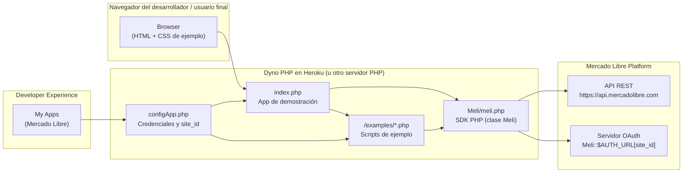
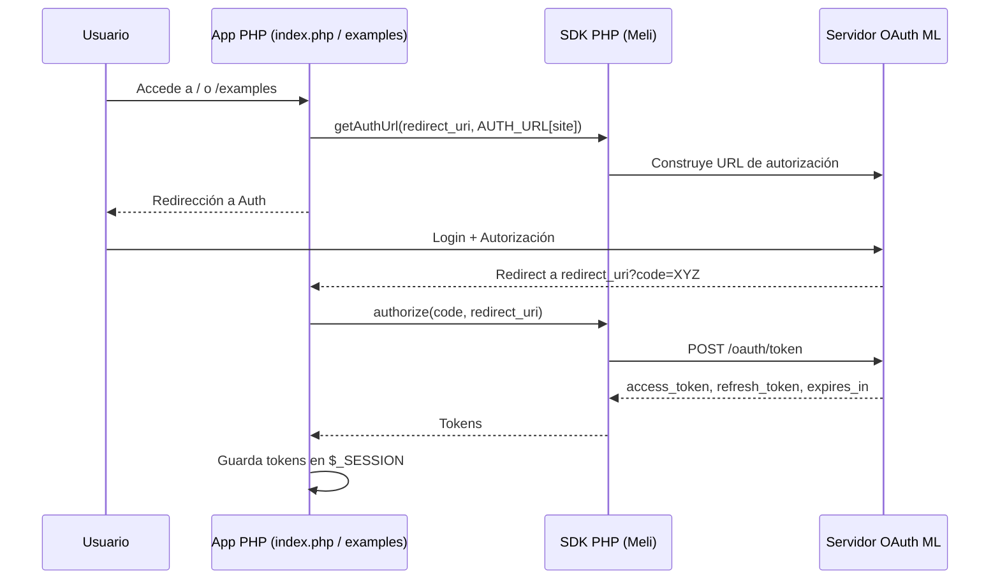

## Visión general

Este repositorio contiene el **SDK oficial de Mercado Libre para PHP**.  
Su objetivo es **simplificar al máximo la integración con la API de Mercado Libre**, ocultando los detalles de HTTP, OAuth 2.0 y serialización JSON detrás de una clase (`Meli`) con métodos de alto nivel.

Está pensado para:

- **Equipos de producto y backend** que necesitan publicar ítems, consultar órdenes, usuarios, preguntas, etc. a través de la API de Mercado Libre.
- **Desarrolladores que recién empiezan con la API** y requieren ejemplos completos y ejecutables.
- **Despliegues rápidos en Heroku**, usando el botón de deploy o el archivo `app.json`.

En otras palabras, el SDK resuelve el problema de:

> “Quiero consumir la API de Mercado Libre desde PHP sin reimplementar OAuth, manejo de tokens, ni clientes HTTP.”

---

## Stack tecnológico

- **Lenguaje principal: PHP**
  - Toda la lógica del SDK está implementada en PHP procedural/orientado a objetos.
  - `index.php` actúa como aplicación de ejemplo / landing para el SDK.

- **Librerías nativas de PHP**
  - **cURL**: usada internamente por la clase `Meli` para realizar llamadas HTTP (`GET`, `POST`, `PUT`, `DELETE`, `OPTIONS`) hacia `https://api.mercadolibre.com`.
  - **JSON**: serialización y deserialización de cuerpos de petición y respuesta.
  - **Sesiones (`$_SESSION`)**: almacenamiento de `access_token`, `refresh_token` y expiración en ejemplos y en `index.php`.

- **Plataforma de despliegue**
  - **Heroku (PaaS)**:
    - `app.json` define el buildpack `heroku/php` y las variables de entorno necesarias (`App_ID`, `Secret_Key`, `Redirect_URI`).
    - Pensado para desplegar una **aplicación de demostración** que usa el SDK.

- **Testing**
  - **PHPUnit**:
    - En `tests/` hay pruebas unitarias para la clase `Meli` y reportes de cobertura generados.
    - Uso extensivo de **mocks** para simular respuestas de la API y del flujo OAuth.

---

## Arquitectura de alto nivel

La arquitectura es la de una **librería cliente (SDK) monolítica** con:

- Una **clase núcleo**: `Meli` (`Meli/meli.php`), que encapsula:
  - Construcción de URLs de la API.
  - Flujo OAuth 2.0 (authorization code, refresh token).
  - Ejecución de requests HTTP con cURL.
- Una **aplicación de ejemplo**:
  - `index.php` como landing page/tutorial.
  - Carpeta `examples/` con scripts que muestran casos de uso concretos: login OAuth, publicación de ítems, borrado de preguntas, actualización de descripciones, etc.
- **Sin base de datos propia**:
  - El estado se mantiene en **sesión HTTP** y variables de entorno.
  - Toda la “persistencia real” ocurre en la **API de Mercado Libre**.

Arquitectónicamente se puede describir como:

- **Patrón Gateway / Service Client**: la clase `Meli` es una fachada que expone una API de alto nivel sobre la API HTTP externa.
- **Sample App / Quickstart**: el resto del proyecto funciona como ejemplo de referencia para integradores.

### Diagrama de arquitectura (alto nivel)

---

## Modelos de datos principales (conceptuales)

El SDK no define entidades ricas propias; trabaja principalmente con:

- **Tokens de autenticación**
  - `access_token`, `refresh_token`, `expires_in`:
    - Obtenidos y refrescados vía `Meli::authorize()` y `Meli::refreshAccessToken()`.
    - Almacenados en `$_SESSION` por los ejemplos (`index.php`, `examples/example_login.php`, etc.).

- **Recursos de la API de Mercado Libre**
  - Representados como **arrays asociativos PHP** que luego se convierten a JSON.
  - Ejemplos:
    - **Sitio**: resultado de `GET /sites/{site_id}`.
    - **Ítem**: cuerpo enviado a `POST /items` para publicar un producto.
    - **Pregunta**: usada en `DELETE /questions/{id}`.
    - **Descripción de ítem**: actualizada vía `PUT /items/{id}/descriptions`.

A nivel de diseño, el “modelo” principal es el propio **cliente `Meli`**, que conoce:

- El **endpoint raíz** de la API (`https://api.mercadolibre.com`).
- Las **URLs de autenticación** por país (`Meli::$AUTH_URL`).
- Cómo construir rutas (`make_path`), ejecutar cURL (`execute`) y mapear resultados.

---

## Flujos de negocio críticos

### 1. Autenticación OAuth 2.0 (Authorization Code)

Este flujo es el corazón del SDK, ya que sin un `access_token` válido no es posible interactuar con recursos protegidos.

Pasos típicos:

1. **Configurar credenciales de la app**
   - Definidas como variables de entorno en Heroku (`App_ID`, `Secret_Key`, `Redirect_URI`) o directamente en `configApp.php`.
2. **Instanciar el cliente**
   - `new Meli($appId, $secretKey);`
3. **Obtener URL de login**
   - `getAuthUrl($redirectURI, Meli::$AUTH_URL[$siteId])`
   - Se redirige al usuario a la pantalla de login/autorización de Mercado Libre.
4. **Recibir `code` en el callback**
   - Mercado Libre redirige a `Redirect_URI` con `?code=...`.
5. **Intercambiar `code` por tokens**
   - `authorize($code, $redirectURI)` devuelve `access_token`, `refresh_token` y `expires_in`.
6. **Guardar tokens en sesión**
   - Ejemplos guardan todo en `$_SESSION` para uso posterior.
7. **Refrescar tokens cuando expiran**
   - `refreshAccessToken()` usa el `refresh_token` para obtener un nuevo `access_token`.

Diagrama simplificado:

---

### 2. Consumo de la API REST (GET/POST/PUT/DELETE/OPTIONS)

Una vez autenticado, la aplicación utiliza métodos de la clase `Meli` para operar sobre la API:

- **GET** (`get($path, $params)`):
  - Ejemplo: `GET /sites/{site_id}` para obtener metadatos del sitio.
- **POST** (`post($path, $body, $params)`):
  - Ejemplo: `POST /items` para publicar un ítem.
- **PUT** (`put($path, $body, $params)`):
  - Ejemplo: actualizar la descripción de un ítem.
- **DELETE** (`delete($path, $params)`):
  - Ejemplo: borrar una pregunta (`/questions/{id}`).
- **OPTIONS** (`options($path, $params)`):
  - Para conocer métodos soportados por un recurso.

Cada uno de estos métodos:

- Construye la URL final con `make_path`.
- Serializa el `body` a JSON cuando aplica.
- Configura cURL con los headers y verbo HTTP adecuados.
- Devuelve un array PHP con:
  - `body`: respuesta JSON decodificada.
  - `httpCode`: código HTTP de la respuesta.

---

### 3. Ejemplos de negocio incluidos

- **Autenticación y mantenimiento de sesión**
  - `examples/example_login.php` y la sección OAuth en `index.php`.
- **Consulta de información de sitios**
  - `examples/example_get.php` (`GET /sites/{site_id}`).
- **Publicación de ítems de prueba**
  - `examples/example_list_item.php` y la sección “Publish an Item” en `index.php`.
- **Gestión de preguntas y descripciones**
  - `examples/example_delete_question.php`: borra una pregunta.
  - `examples/example_put_description.php`: actualiza la descripción de un ítem.

Estos ejemplos sirven como **recetas de negocio** que un desarrollador puede copiar, adaptar y extender en su propia aplicación.

---

## Público objetivo y estrategia de contribución

- **Onboarding de nuevos desarrolladores**
  - Leer primero `README.md` (uso básico del SDK).
  - Revisar este `OVERVIEW.md` para entender arquitectura y flujos.
  - Ejecutar `index.php` y los scripts en `examples/` para ver la integración end‑to‑end.

- **Comunidad open source**
  - El SDK está diseñado como **capa delgada**: facilita contribuciones incrementales (`pull requests` que agreguen nuevos helpers, mejores validaciones, etc.).
  - Las pruebas en `tests/` y los reportes en `tests/_reports/` ayudan a asegurar que los cambios mantengan la compatibilidad.

Para colaborar:

- Hacer fork del repositorio.
- Crear una rama temática.
- Agregar o ajustar pruebas en `tests/`.
- Proponer mejoras a la clase `Meli` o nuevos ejemplos de negocio.

