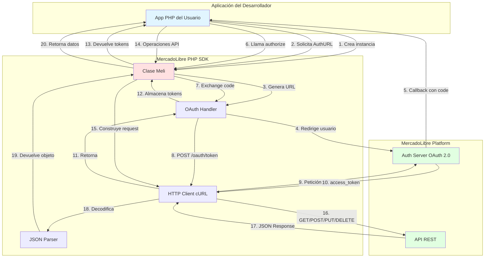
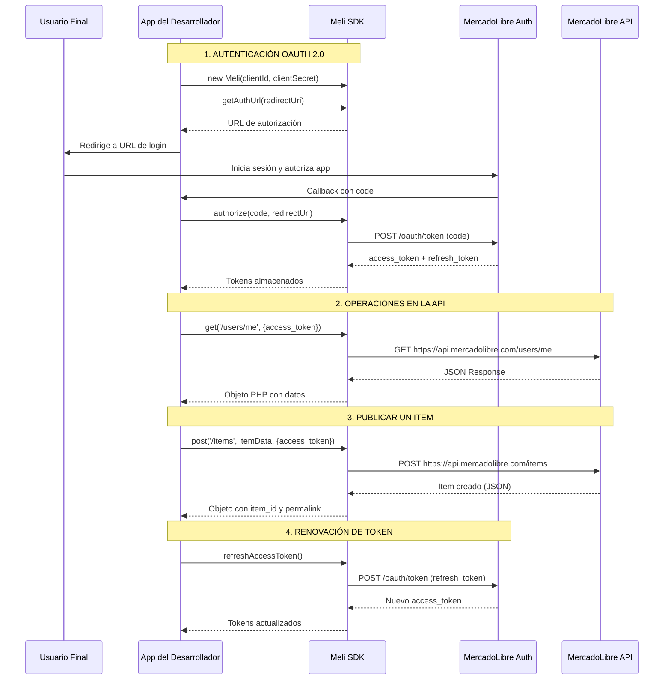
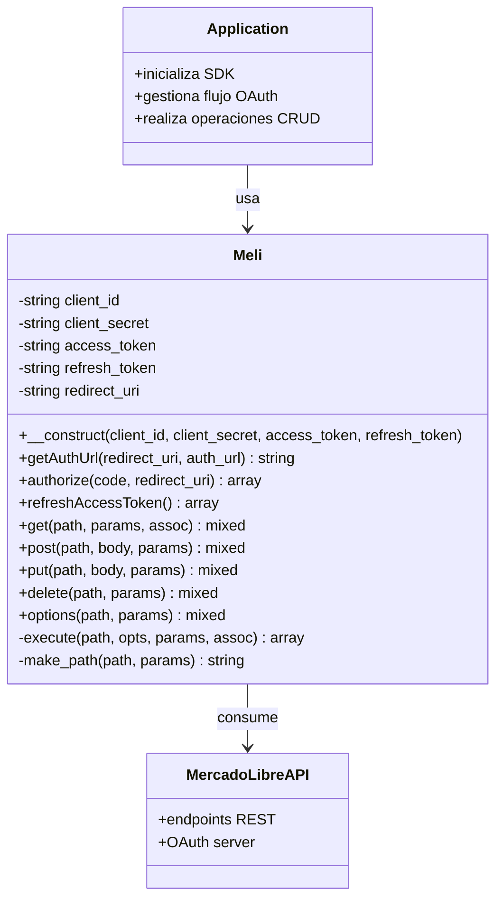

# 📘 Visión General del Proyecto

## 🎯 Propósito del Proyecto

**MercadoLibre PHP SDK** es el kit de desarrollo oficial en PHP para interactuar con la plataforma de MercadoLibre (el marketplace más grande de América Latina). 

### ¿Qué problema resuelve?

Este SDK simplifica la integración con la API de MercadoLibre al proporcionar:

- **Gestión automatizada del flujo OAuth 2.0**: Maneja autenticación, autorización y renovación de tokens sin esfuerzo manual.
- **Abstracción de peticiones HTTP**: Envuelve las operaciones CRUD (GET, POST, PUT, DELETE) a la API REST de MercadoLibre.
- **Manejo multi-país**: Soporte nativo para todos los sitios de MercadoLibre (Argentina, Brasil, México, Colombia, Chile, etc.).
- **Reducción de boilerplate**: Elimina la necesidad de escribir código repetitivo para autenticación y peticiones HTTP.

### Casos de uso principales

1. **Publicar productos programáticamente** en MercadoLibre desde sistemas ERP/PIM
2. **Sincronizar inventarios** entre tiendas físicas y el marketplace
3. **Gestionar pedidos y preguntas** de clientes de forma automatizada
4. **Construir aplicaciones de terceros** que extiendan la funcionalidad de MercadoLibre

---

## 🛠️ Stack Tecnológico

### Lenguaje y Runtime
- **PHP** >= 5.3 (compatible con versiones modernas hasta PHP 8.x)
- No requiere frameworks adicionales (SDK standalone)

### Dependencias Core
| Tecnología | Propósito | Justificación |
|------------|-----------|---------------|
| **cURL** | Cliente HTTP | Estándar de PHP para peticiones HTTP/HTTPS con soporte SSL/TLS robusto |
| **JSON** | Serialización de datos | Formato nativo de la API de MercadoLibre |
| **Sessions (PHP)** | Gestión de estado | Almacenamiento temporal de access_tokens en ejemplos |

### Protocolo de Autenticación
- **OAuth 2.0** (Authorization Code Grant)
  - Flujo de autorización estándar web
  - Soporte para `refresh_token` (offline access)

### APIs Externas
- **MercadoLibre API REST** (https://api.mercadolibre.com)
- **MercadoLibre Auth Servers** (múltiples endpoints según el país)

### Herramientas de Desarrollo
- **PHPUnit**: Framework de testing (presente en `/tests`)
- **Composer**: Gestor de dependencias (preparado para usar con `composer.json`)
- **Git**: Control de versiones

---

## 🏗️ Arquitectura de Alto Nivel

### Tipo de Arquitectura
**SDK Client Library** con patrón **Adapter/Wrapper** sobre cURL.

### Flujo de Comunicación Simplificado

---

## 📦 Componentes Principales

### 1. Clase `Meli` (Core)
**Responsabilidad**: Orquestador principal del SDK
- Gestión de credenciales (client_id, client_secret)
- Métodos públicos para OAuth (authorize, refreshAccessToken)
- Métodos HTTP (get, post, put, delete, options)
- Constructor de URLs y ejecución de peticiones cURL

### 2. OAuth Flow Handler
**Responsabilidad**: Implementación del flujo OAuth 2.0
- Generación de URLs de autorización por país
- Intercambio de authorization_code por access_token
- Renovación automática de tokens expirados

### 3. HTTP Client (cURL Wrapper)
**Responsabilidad**: Capa de transporte HTTP
- Configuración de opciones cURL (SSL, timeouts, user-agent)
- Ejecución de peticiones y manejo de respuestas
- Parsing de códigos de estado HTTP

---

## 🌍 Soporte Multi-Región

El SDK soporta **14 sitios** de MercadoLibre:

| Site ID | País | Auth URL |
|---------|------|----------|
| MLA | 🇦🇷 Argentina | https://auth.mercadolibre.com.ar |
| MLB | 🇧🇷 Brasil | https://auth.mercadolivre.com.br |
| MLM | 🇲🇽 México | https://auth.mercadolibre.com.mx |
| MCO | 🇨🇴 Colombia | https://auth.mercadolibre.com.co |
| MLC | 🇨🇱 Chile | https://auth.mercadolibre.cl |
| MLU | 🇺🇾 Uruguay | https://auth.mercadolibre.com.uy |
| MPE | 🇵🇪 Perú | https://auth.mercadolibre.com.pe |
| MLV | 🇻🇪 Venezuela | https://auth.mercadolibre.com.ve |
| MCR | 🇨🇷 Costa Rica | https://auth.mercadolibre.com.cr |
| MPA | 🇵🇦 Panamá | https://auth.mercadolibre.com.pa |
| MEC | 🇪🇨 Ecuador | https://auth.mercadolibre.com.ec |
| MRD | 🇩🇴 República Dominicana | https://auth.mercadolibre.com.do |
| MPT | 🇵🇹 Portugal | https://auth.mercadolibre.com.pt |
| CBT | 🌐 Cross Border Trade | https://global-selling.mercadolibre.com |

---

## 🎨 Modelo de Diseño

### Patrón Principal: **Client Library / SDK Pattern**

### Patrones Detectados
1. **Facade Pattern**: La clase `Meli` oculta la complejidad de OAuth y cURL
2. **Template Method**: `execute()` es el método base que usan get(), post(), put(), delete()
3. **Adapter Pattern**: Adapta cURL a una interfaz simple (get/post/put/delete)

---

## 🚀 Valor para Desarrolladores

### Para Desarrolladores Junior
- **Curva de aprendizaje suave**: Solo necesitas instanciar `Meli` y llamar métodos
- **Ejemplos abundantes**: 5 ejemplos funcionales en `/examples`
- **Sin dependencias complejas**: PHP puro sin frameworks

### Para Desarrolladores Senior
- **Código limpio y extensible**: Fácil de heredar o decorar
- **Testing preparado**: Suite de tests con PHPUnit
- **Deploy a Heroku listo**: Botón one-click para demo
- **Producción-ready**: Manejo de SSL, timeouts configurables, refresh automático

---

## 📊 Métricas del Proyecto

- **Versión actual**: 2.0.0
- **Líneas de código core**: ~300 LOC (clase Meli)
- **Complejidad ciclomática**: Baja (funciones simples y directas)
- **Cobertura de tests**: Presente (ver `/tests`)
- **Licencia**: Open Source (Apache 2.0 / MIT - revisar LICENSE)

---

## 🔗 Enlaces Importantes

- **Portal de Desarrolladores**: https://developers.mercadolibre.com
- **API Docs**: https://developers.mercadolibre.com/api-docs
- **Crear Aplicación**: https://developers.mercadolibre.com/apps/home
- **Comunidad**: https://developers.mercadolibre.com/community

---

## 🎓 Próximos Pasos

1. Leer [SETUP_AND_INSTALLATION.md](./SETUP_AND_INSTALLATION.md) para configurar el SDK
2. Revisar [PROJECT_STRUCTURE.md](./PROJECT_STRUCTURE.md) para entender la organización del código
3. Estudiar [API_REFERENCE.md](./API_REFERENCE.md) para ver todos los métodos disponibles
4. Explorar [EXAMPLES.md](./EXAMPLES.md) para casos de uso reales
5. Consultar [CONTRIBUTING.md](./CONTRIBUTING.md) si deseas contribuir

---

**Última actualización**: Noviembre 2025  
**Mantenedor**: MercadoLibre Developers Team

