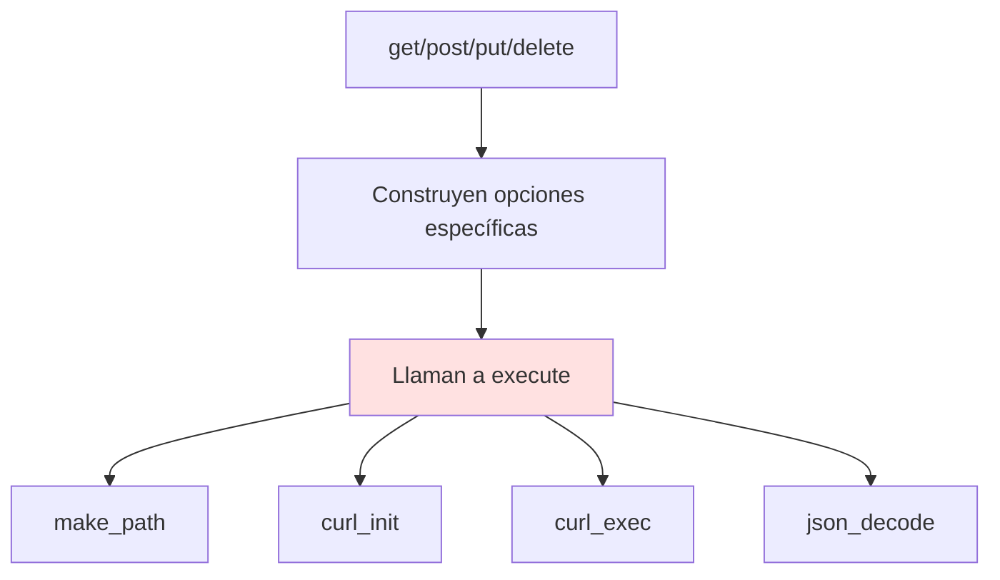
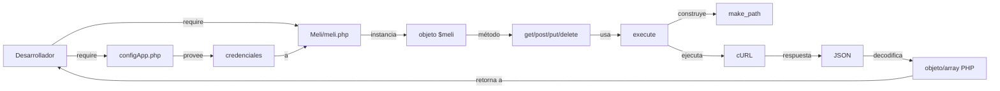
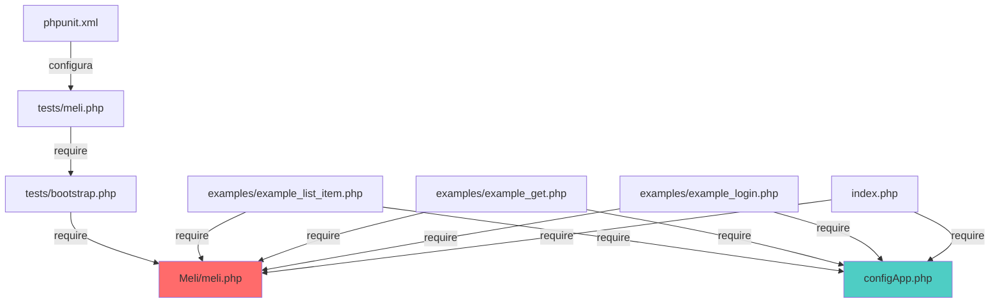

# 🗂️ Estructura del Proyecto

## 📁 Árbol de Directorios

```
gmi/
├── 📄 index.php                 # Demo interactiva del SDK (Heroku-ready)
├── 📄 configApp.php             # Configuración de credenciales
├── 📄 composer.json             # Gestor de dependencias (vacío, para extensibilidad)
├── 📄 app.json                  # Configuración para deploy en Heroku
├── 📄 changelog.md              # Historial de versiones
├── 📄 LICENSE                   # Licencia del proyecto
├── 📄 README.md                 # Documentación principal
│
├── 📁 Meli/                     # ⭐ NÚCLEO DEL SDK
│   └── meli.php                 # Clase principal del SDK
│
├── 📁 examples/                 # 🎯 EJEMPLOS DE USO
│   ├── example_login.php        # Flujo OAuth completo con sesiones
│   ├── example_get.php          # Consulta de información (GET)
│   ├── example_list_item.php   # Publicar un producto (POST)
│   ├── example_put_description.php  # Actualizar item (PUT)
│   └── example_delete_question.php  # Eliminar pregunta (DELETE)
│
├── 📁 tests/                    # 🧪 SUITE DE TESTING
│   ├── bootstrap.php            # Inicialización de tests
│   ├── meli.php                 # Tests unitarios de la clase Meli
│   ├── phpunit.xml              # Configuración de PHPUnit
│   └── _reports/                # Reportes generados automáticamente
│       ├── coverage/            # Cobertura de código (HTML)
│       └── xunit-results.*      # Resultados en formatos JUnit/TAP/TestDox
│
├── 📁 getting-started/          # 🎨 ASSETS DE LA DEMO
│   ├── logo-developers.png
│   └── style.css                # Estilos para index.php
│
└── 📁 docs/                     # 📚 DOCUMENTACIÓN (esta carpeta)
    ├── OVERVIEW.md
    ├── PROJECT_STRUCTURE.md     # ← Estás aquí
    ├── SETUP_AND_INSTALLATION.md
    ├── API_REFERENCE.md
    ├── EXAMPLES.md
    └── CONTRIBUTING.md
```

---

## 🧩 Componentes Clave

### 1️⃣ `/Meli/meli.php` - Núcleo del SDK

**¿Qué hace?**  
Contiene la clase `Meli`, el corazón del SDK. Esta clase gestiona:
- Autenticación OAuth 2.0
- Peticiones HTTP (GET, POST, PUT, DELETE, OPTIONS)
- Construcción de URLs
- Manejo de tokens

**¿Cuándo modificarlo?**
- Agregar nuevos métodos HTTP (ej: PATCH)
- Cambiar configuraciones de cURL
- Extender funcionalidad del SDK

**Dependencias internas**: Ninguna (standalone)

---

### 2️⃣ `/examples/` - Casos de Uso Prácticos

Esta carpeta contiene **5 ejemplos funcionales** que demuestran los flujos principales:

| Archivo | Descripción | Flujo que demuestra |
|---------|-------------|---------------------|
| `example_login.php` | Autenticación completa | OAuth 2.0 con manejo de sesiones y refresh |
| `example_get.php` | Consulta simple | GET a `/sites/{site_id}` sin autenticación |
| `example_list_item.php` | Publicar producto | POST a `/items` con autenticación |
| `example_put_description.php` | Actualizar item | PUT a `/items/{id}` con autenticación |
| `example_delete_question.php` | Eliminar pregunta | DELETE a `/questions/{id}` con autenticación |

**Nota importante**: Todos los ejemplos incluyen `require '../Meli/meli.php'` y `require '../configApp.php'`.

---

### 3️⃣ `configApp.php` - Configuración Centralizada

```php
<?php
$appId = getenv('App_ID');        // Tu Application ID de MercadoLibre
$secretKey = getenv('Secret_Key'); // Tu Secret Key
$redirectURI = getenv('Redirect_URI'); // URL de callback OAuth
$siteId = 'MLA';                   // Sitio por defecto (Argentina)
```

**Variables de entorno soportadas**:
- `App_ID`: Tu Client ID de la aplicación
- `Secret_Key`: Tu Client Secret
- `Redirect_URI`: URL donde MercadoLibre redirige tras autorización

**Uso en Heroku**: Estas variables se configuran automáticamente desde `app.json`.

**Uso en desarrollo local**: Comenta las líneas con `getenv()` y asigna valores directos.

---

### 4️⃣ `index.php` - Demo Interactiva

**Propósito**: Landing page con ejemplos ejecutables en vivo.

**Características**:
- Flujo OAuth completo en la misma página
- Ejemplo de publicación de item
- Consulta de información del sitio
- Diseño responsive con Bootstrap

**Despliegue**: Optimizado para Heroku con el botón "Deploy to Heroku".

---

### 5️⃣ `/tests/` - Suite de Testing

```
tests/
├── bootstrap.php       # Autoload y setup inicial
├── meli.php           # Tests de la clase Meli
├── phpunit.xml        # Configuración: testsuites, cobertura, formato
└── _reports/          # Generados automáticamente al ejecutar tests
    ├── coverage/      # Reporte visual HTML de cobertura
    │   ├── index.html
    │   ├── meli.php.html
    │   └── css/js/img
    ├── xunit-results.junit.xml  # Formato JUnit (CI/CD)
    ├── xunit-results.tap        # Formato TAP
    └── xunit-results.testdox.html # Formato TestDox
```

**Ejecutar tests**:
```bash
cd tests
phpunit --configuration phpunit.xml
```

**Ver cobertura**:
```bash
open _reports/coverage/index.html
```

---

## 🏗️ Patrones de Diseño Detectados

### 1. **Singleton Implícito** (configuración estática)
```php
protected static $API_ROOT_URL = "https://api.mercadolibre.com";
public static $AUTH_URL = array(...);
public static $CURL_OPTS = array(...);
```
**Ventaja**: Configuración compartida entre instancias.  
**Ubicación**: `Meli/meli.php` líneas 14-42

---

### 2. **Template Method** (ejecución de peticiones)


**Descripción**: El método `execute()` es el "template" que todos los métodos HTTP (get, post, put, delete) invocan con opciones personalizadas.

**Código**:
```php
// Template base
public function execute($path, $opts = array(), $params = array(), $assoc = false) {
    $uri = $this->make_path($path, $params);
    $ch = curl_init($uri);
    curl_setopt_array($ch, self::$CURL_OPTS);
    if(!empty($opts)) curl_setopt_array($ch, $opts);
    
    $return["body"] = json_decode(curl_exec($ch), $assoc);
    $return["httpCode"] = curl_getinfo($ch, CURLINFO_HTTP_CODE);
    curl_close($ch);
    return $return;
}

// Métodos específicos que usan el template
public function post($path, $body = null, $params = array()) {
    $body = json_encode($body);
    $opts = array(
        CURLOPT_HTTPHEADER => array('Content-Type: application/json'),
        CURLOPT_POST => true, 
        CURLOPT_POSTFIELDS => $body
    );
    return $this->execute($path, $opts, $params);
}
```

**Ubicación**: `Meli/meli.php` líneas 170-249

---

### 3. **Facade Pattern** (simplificación de OAuth + cURL)
La clase `Meli` oculta la complejidad de:
- Construcción manual de peticiones cURL
- Manejo de headers HTTP
- Intercambio de códigos OAuth por tokens
- Renovación de tokens

**Antes (sin SDK)**:
```php
// El desarrollador tendría que hacer esto manualmente
$ch = curl_init('https://api.mercadolibre.com/oauth/token');
curl_setopt($ch, CURLOPT_POST, true);
curl_setopt($ch, CURLOPT_POSTFIELDS, http_build_query([
    'grant_type' => 'authorization_code',
    'client_id' => $appId,
    'client_secret' => $secretKey,
    'code' => $code,
    'redirect_uri' => $redirectUri
]));
// ... más configuración ...
$response = curl_exec($ch);
$data = json_decode($response);
```

**Ahora (con SDK)**:
```php
$meli = new Meli($appId, $secretKey);
$user = $meli->authorize($code, $redirectUri);
$accessToken = $user['body']->access_token;
```

---

### 4. **Adapter Pattern** (cURL → API REST)
El SDK adapta la API de cURL (procedimental, compleja) a una interfaz orientada a objetos simple:

```
cURL API (bajo nivel)     →    Meli SDK (alto nivel)
─────────────────────          ────────────────────
curl_init()                    $meli->get()
curl_setopt()                  $meli->post()
curl_exec()                    $meli->put()
curl_close()                   $meli->delete()
```

---

## 📦 Organización Lógica

### ¿Dónde vive cada responsabilidad?

| Responsabilidad | Ubicación | Archivos |
|----------------|-----------|----------|
| **Core del SDK** | `/Meli/` | `meli.php` |
| **Configuración** | Raíz | `configApp.php` |
| **Ejemplos de integración** | `/examples/` | `*.php` |
| **Tests unitarios** | `/tests/` | `meli.php`, `phpunit.xml` |
| **Demo en vivo** | Raíz | `index.php` |
| **Assets estáticos** | `/getting-started/` | `*.css`, `*.png` |
| **Documentación técnica** | `/docs/` | `*.md` |
| **Configuración de deploy** | Raíz | `app.json`, `composer.json` |

---

## 🔍 Guía de Navegación Rápida

### "Quiero entender cómo funciona OAuth"
1. Lee `Meli/meli.php` líneas 72-118 (métodos `getAuthUrl()` y `authorize()`)
2. Ejecuta `examples/example_login.php`
3. Observa el flujo completo en `index.php` líneas 87-126

### "Quiero saber cómo hacer un POST a la API"
1. Revisa `Meli/meli.php` líneas 183-194 (método `post()`)
2. Estudia el ejemplo completo en `examples/example_list_item.php`
3. Ve el caso de uso en `index.php` líneas 258-341

### "Necesito ejecutar los tests"
```bash
cd tests
phpunit --testdox           # Ver resultados descriptivos
phpunit --coverage-html _reports/coverage  # Generar cobertura
```

### "Quiero extender el SDK con nuevos métodos"
1. Abre `Meli/meli.php`
2. Agrega tu método siguiendo el patrón de `get()`, `post()`, etc.
3. Reutiliza `execute()` como método base
4. Escribe tests en `tests/meli.php`

---

## 🚦 Flujo de Datos



---

## 📝 Convenciones del Código

### Nomenclatura
- **Clases**: PascalCase (`Meli`)
- **Métodos públicos**: camelCase (`getAuthUrl`, `refreshAccessToken`)
- **Métodos privados**: camelCase con prefijo `_` implícito (no hay privados reales)
- **Variables**: snake_case (`$access_token`, `$client_id`)
- **Constantes**: UPPER_SNAKE_CASE (`$API_ROOT_URL`, `$OAUTH_URL`)

### Estilo de Código
- **Indentación**: 4 espacios (no tabs)
- **Llaves**: Estilo K&R (llave en misma línea de declaración)
- **Documentación**: PHPDoc en métodos públicos

### Manejo de Errores
- **Sin excepciones**: El SDK retorna arrays con `httpCode` y `body`
- **Responsabilidad del desarrollador**: Verificar códigos HTTP (200, 401, etc.)

---

## 🎯 Puntos de Extensión

### 1. Agregar Logging
```php
public function execute($path, $opts = array(), $params = array(), $assoc = false) {
    $uri = $this->make_path($path, $params);
    error_log("Meli SDK: Requesting $uri"); // ← AGREGAR AQUÍ
    // ... resto del código ...
}
```

### 2. Implementar Cache de Tokens
```php
public function __construct($client_id, $client_secret, $access_token = null, $refresh_token = null) {
    $this->client_id = $client_id;
    $this->client_secret = $client_secret;
    
    // ← AGREGAR: Cargar desde Redis/Memcached
    $cached = $this->loadFromCache();
    $this->access_token = $cached['access_token'] ?? $access_token;
    $this->refresh_token = $cached['refresh_token'] ?? $refresh_token;
}
```

### 3. Agregar Retry Logic
```php
public function execute($path, $opts = array(), $params = array(), $assoc = false) {
    $maxRetries = 3;
    $attempt = 0;
    
    while ($attempt < $maxRetries) {
        // ... ejecutar petición ...
        if ($return["httpCode"] < 500) break;
        $attempt++;
        sleep(pow(2, $attempt)); // Exponential backoff
    }
    
    return $return;
}
```

---

## 📚 Archivos de Configuración

### `app.json` (Heroku)
```json
{
  "name": "MercadoLibre PHP SDK",
  "description": "Heroku-ready demo",
  "env": {
    "App_ID": {
      "description": "Your MercadoLibre Application ID"
    },
    "Secret_Key": {
      "description": "Your Secret Key"
    },
    "Redirect_URI": {
      "description": "OAuth Callback URL"
    }
  }
}
```

### `phpunit.xml` (Testing)
```xml
<phpunit bootstrap="bootstrap.php">
    <testsuites>
        <testsuite name="MeliSDK">
            <file>meli.php</file>
        </testsuite>
    </testsuites>
    <logging>
        <log type="coverage-html" target="_reports/coverage"/>
        <log type="junit" target="_reports/xunit-results.junit.xml"/>
    </logging>
</phpunit>
```

---

## 🔗 Relación Entre Archivos



---

## 🎓 Recomendaciones para Nuevos Desarrolladores

### Si eres Junior
1. **Empieza por**: `examples/example_get.php` (el más simple)
2. **Luego ve a**: `examples/example_login.php` (entender OAuth)
3. **Finalmente**: `examples/example_list_item.php` (caso completo)
4. **Lee el core**: `Meli/meli.php` línea por línea con comentarios

### Si eres Senior
1. **Revisa primero**: `Meli/meli.php` (estructura completa)
2. **Analiza**: `tests/meli.php` (cobertura y casos edge)
3. **Propón mejoras**: Abre issues en GitHub
4. **Contribuye**: Ver [CONTRIBUTING.md](./CONTRIBUTING.md)

---

**Próximo paso**: [SETUP_AND_INSTALLATION.md](./SETUP_AND_INSTALLATION.md)

