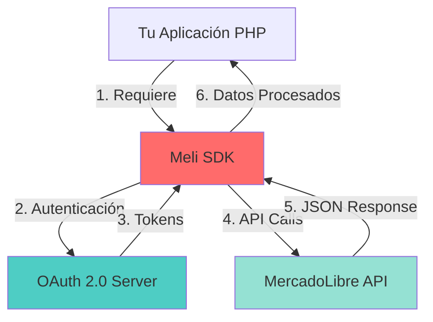
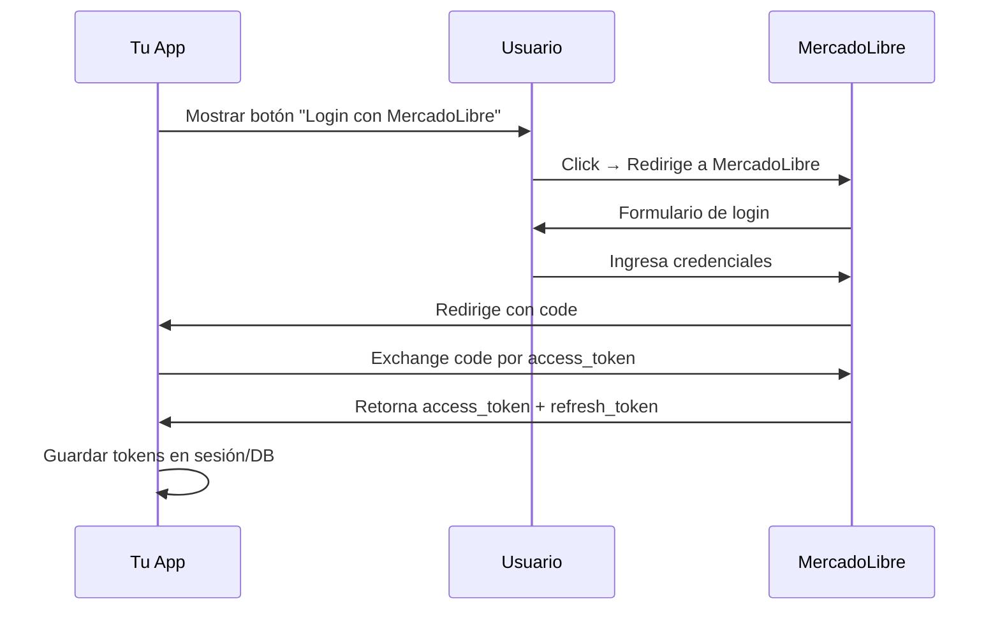

# 📚 Documentación del SDK de PHP para MercadoLibre

¡Bienvenido a la documentación oficial del SDK de PHP para MercadoLibre! Esta guía completa te ayudará a integrar tu aplicación con el marketplace más grande de América Latina.

---

## 🚀 Inicio Rápido

```php
<?php
// 1. Incluir el SDK
require 'Meli/meli.php';

// 2. Configurar credenciales
$meli = new Meli('TU_APP_ID', 'TU_SECRET_KEY');

// 3. Obtener URL de autorización
$authUrl = $meli->getAuthUrl(
    'http://localhost/callback.php',
    Meli::$AUTH_URL['MLB']  // Brasil
);

// 4. Redirigir usuario para autenticación
header("Location: $authUrl");
```

---

## 📖 Documentación Completa

### Para Empezar

| Documento | Descripción | Ideal para |
|-----------|-------------|------------|
| **[OVERVIEW.md](./OVERVIEW.md)** | Visión general del proyecto, arquitectura y stack tecnológico | Arquitectos, Tech Leads |
| **[SETUP_AND_INSTALLATION.md](./SETUP_AND_INSTALLATION.md)** | Instalación, configuración y deployment | Desarrolladores nuevos |
| **[PROJECT_STRUCTURE.md](./PROJECT_STRUCTURE.md)** | Organización del código y patrones de diseño | Desarrolladores que contribuyen |

### Referencia Técnica

| Documento | Descripción | Ideal para |
|-----------|-------------|------------|
| **[API_REFERENCE.md](./API_REFERENCE.md)** | Documentación completa de todos los métodos del SDK | Desarrolladores en implementación |
| **[EXAMPLES.md](./EXAMPLES.md)** | Casos de uso reales y código de ejemplo | Desarrolladores buscando soluciones específicas |
| **[GLOSSARY.md](./GLOSSARY.md)** | Glosario de términos técnicos y conceptos | Todos los niveles |

### Soporte y Contribución

| Documento | Descripción | Ideal para |
|-----------|-------------|------------|
| **[FAQ.md](./FAQ.md)** | Preguntas frecuentes | Resolución rápida de dudas |
| **[TROUBLESHOOTING.md](./TROUBLESHOOTING.md)** | Guía de resolución de problemas | Debugging y solución de errores |
| **[CONTRIBUTING.md](./CONTRIBUTING.md)** | Cómo contribuir al proyecto | Desarrolladores que desean contribuir |

---

## 🎯 Rutas de Aprendizaje

### 👶 Desarrollador Junior / Nuevo en MercadoLibre

1. Lee **[OVERVIEW.md](./OVERVIEW.md)** para entender qué hace el SDK
2. Sigue **[SETUP_AND_INSTALLATION.md](./SETUP_AND_INSTALLATION.md)** paso a paso
3. Ejecuta los ejemplos en `/examples/example_login.php`
4. Lee **[EXAMPLES.md](./EXAMPLES.md)** - Sección "Autenticación OAuth"
5. Consulta **[FAQ.md](./FAQ.md)** cuando tengas dudas
6. Usa **[TROUBLESHOOTING.md](./TROUBLESHOOTING.md)** si algo no funciona

**Tiempo estimado**: 2-3 horas para primer "Hello World"

---

### 💼 Desarrollador con Experiencia

1. **Quick scan** de **[OVERVIEW.md](./OVERVIEW.md)** - Arquitectura
2. Instala según **[SETUP_AND_INSTALLATION.md](./SETUP_AND_INSTALLATION.md)**
3. Consulta **[API_REFERENCE.md](./API_REFERENCE.md)** como referencia
4. Revisa **[PROJECT_STRUCTURE.md](./PROJECT_STRUCTURE.md)** para extensiones
5. Implementa casos de uso específicos con **[EXAMPLES.md](./EXAMPLES.md)**

**Tiempo estimado**: 30-60 minutos hasta primer deploy

---

### 🏗️ Arquitecto / Tech Lead

1. **[OVERVIEW.md](./OVERVIEW.md)** - Diagramas de arquitectura y decisiones de diseño
2. **[PROJECT_STRUCTURE.md](./PROJECT_STRUCTURE.md)** - Patrones y organización
3. **[API_REFERENCE.md](./API_REFERENCE.md)** - Capacidades y limitaciones
4. **[SETUP_AND_INSTALLATION.md](./SETUP_AND_INSTALLATION.md)** - Sección "Deploy en Producción"

**Tiempo estimado**: 15-30 minutos para evaluación técnica

---

## 🔍 Búsqueda Rápida

### "Quiero hacer X"

| Necesidad | Documento | Sección |
|-----------|-----------|---------|
| Autenticar un usuario | [EXAMPLES.md](./EXAMPLES.md) | 1. Autenticación OAuth |
| Publicar un producto | [EXAMPLES.md](./EXAMPLES.md) | 2.1 Publicar un Producto Completo |
| Actualizar precio/stock | [EXAMPLES.md](./EXAMPLES.md) | 2.2 Actualizar Precio y Stock |
| Responder preguntas | [EXAMPLES.md](./EXAMPLES.md) | 4.2 Responder Preguntas |
| Ver mis pedidos | [EXAMPLES.md](./EXAMPLES.md) | 5.1 Obtener Pedidos del Vendedor |
| Buscar productos | [EXAMPLES.md](./EXAMPLES.md) | 3.1 Búsqueda de Productos |
| Configurar webhooks | [EXAMPLES.md](./EXAMPLES.md) | 6. Notificaciones (Webhooks) |

### "Tengo un error X"

| Error | Documento | Solución |
|-------|-----------|----------|
| `invalid_grant` | [TROUBLESHOOTING.md](./TROUBLESHOOTING.md) | Error: "invalid_grant" |
| `redirect_uri_mismatch` | [TROUBLESHOOTING.md](./TROUBLESHOOTING.md) | Error: "redirect_uri_mismatch" |
| `cURL error 60` | [TROUBLESHOOTING.md](./TROUBLESHOOTING.md) | Error: "cURL error 60: SSL certificate" |
| `Too many requests (429)` | [TROUBLESHOOTING.md](./TROUBLESHOOTING.md) | Error 429: Too Many Requests |
| Token expirado | [FAQ.md](./FAQ.md) | ¿Cuánto dura el access_token? |

---

## 📊 Arquitectura Visual



---

## 🎓 Conceptos Clave

### OAuth 2.0 Flow



[Ver documentación completa](./OVERVIEW.md#arquitectura-de-alto-nivel)

---

## 🛠️ Herramientas Útiles

### Testing

```bash
# Ejecutar tests
cd tests
phpunit

# Ver cobertura
phpunit --coverage-html _reports/coverage
open _reports/coverage/index.html
```

### Debugging

```php
// Modo debug con logs detallados
class MeliDebug extends Meli {
    public function execute($path, $opts = array(), $params = array(), $assoc = false) {
        error_log("Meli Request: $path");
        $result = parent::execute($path, $opts, $params, $assoc);
        error_log("Meli Response: HTTP {$result['httpCode']}");
        return $result;
    }
}

$meli = new MeliDebug($appId, $secretKey);
```

[Ver guía completa de debugging](./TROUBLESHOOTING.md#debugging-avanzado)

---

## 📦 Recursos Externos

### Oficiales de MercadoLibre

- **Portal de Desarrolladores**: https://developers.mercadolibre.com
- **API Docs**: https://developers.mercadolibre.com/api-docs
- **Mis Aplicaciones**: https://developers.mercadolibre.com/apps/home
- **Foro de la Comunidad**: https://developers.mercadolibre.com/community
- **Estado de Servicios**: https://status.mercadolibre.com

### Repositorio y Código

- **GitHub**: https://github.com/mercadolibre/php-sdk
- **Issues**: https://github.com/mercadolibre/php-sdk/issues
- **Pull Requests**: https://github.com/mercadolibre/php-sdk/pulls

### Recursos de Aprendizaje

- **OAuth 2.0 Spec**: https://oauth.net/2/
- **PHP cURL**: https://www.php.net/manual/en/book.curl.php
- **JSON en PHP**: https://www.php.net/manual/en/book.json.php

---

## 💡 Tips Pro

### Seguridad

```php
// ✅ SIEMPRE usar variables de entorno en producción
$appId = getenv('MELI_APP_ID') ?: die('Missing credentials');
$secretKey = getenv('MELI_SECRET_KEY') ?: die('Missing credentials');

// ✅ SIEMPRE validar redirect_uri
$allowedUris = ['https://miapp.com/callback'];
if (!in_array($redirectUri, $allowedUris)) {
    die('Invalid redirect URI');
}

// ✅ NUNCA loguear tokens completos
error_log("Token: " . substr($token, 0, 10) . "...");
```

### Performance

```php
// ✅ Cachear respuestas que no cambian
$categories = cache_remember('meli_categories', 3600, function() use ($meli) {
    return $meli->get('/sites/MLB/categories')['body'];
});

// ✅ Usar batch requests cuando sea posible
$items = $meli->get('/items?ids=MLB123,MLB456,MLB789');

// ✅ Implementar rate limiting
sleep(1);  // Esperar entre requests
```

### Manejo de Errores

```php
// ✅ SIEMPRE verificar httpCode
$result = $meli->get('/users/me', ['access_token' => $token]);

if ($result['httpCode'] != 200) {
    error_log("API Error: HTTP {$result['httpCode']}");
    error_log("Message: " . json_encode($result['body']));
    
    // Manejar errores específicos
    switch ($result['httpCode']) {
        case 401:
            // Renovar token
            break;
        case 429:
            // Rate limit, esperar
            break;
        default:
            // Otro error
    }
}
```

---

## 🤝 Contribuir

¿Encontraste un bug? ¿Tienes una mejora? ¡Contribuye!

1. Lee **[CONTRIBUTING.md](./CONTRIBUTING.md)**
2. Fork el repositorio
3. Crea una rama: `git checkout -b feature/mi-mejora`
4. Haz commit: `git commit -m "feat: descripción"`
5. Push: `git push origin feature/mi-mejora`
6. Abre un Pull Request

---

## 📞 Soporte

### ¿Tienes una pregunta?
1. Revisa **[FAQ.md](./FAQ.md)**
2. Busca en [GitHub Issues](https://github.com/mercadolibre/php-sdk/issues)
3. Pregunta en el [foro oficial](https://developers.mercadolibre.com/community)

### ¿Encontraste un bug?
1. Revisa **[TROUBLESHOOTING.md](./TROUBLESHOOTING.md)**
2. Si persiste, [reporta el bug](https://github.com/mercadolibre/php-sdk/issues/new)

### ¿Quieres una nueva funcionalidad?
1. Abre un [Feature Request](https://github.com/mercadolibre/php-sdk/issues/new)
2. Describe el caso de uso
3. Propón una implementación

---

## 📄 Licencia

Este proyecto está bajo licencia open source. Ver archivo [LICENSE](../LICENSE) para más detalles.

---

## 🎉 Agradecimientos

Gracias a todos los [contribuidores](https://github.com/mercadolibre/php-sdk/graphs/contributors) que hacen posible este proyecto.

¿Quieres aparecer aquí? [Contribuye al proyecto](./CONTRIBUTING.md)!

---

**Última actualización**: Noviembre 2025  
**Versión del SDK**: 2.0.0  
**Mantenido por**: MercadoLibre Developers Team

---

<p align="center">
  <strong>¿Listo para empezar?</strong><br>
  <a href="./SETUP_AND_INSTALLATION.md">Instalar el SDK →</a>
</p>

